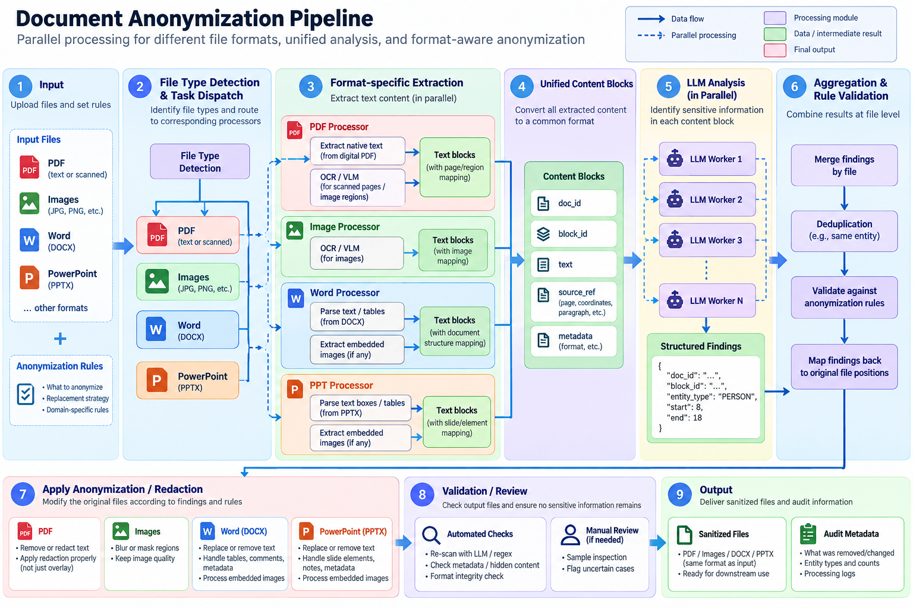

# data-anonymization

Sanitize data before it is sent to a publicly available AI model, and measure whether the sanitized output can still be traced back to a company or a person.

Scope is not limited to office documents. Any data that a person might paste, upload or pipe into a public model is in scope: documents, spreadsheets, databases, images, audio, video, CAD, logs, code, telemetry, sensor data.

Exploratory R&D. Not an official product.

## Why

An organisation with no licence or agreement with an AI provider has no processor contract, no deletion guarantee, and no control over training on input. Anonymization is therefore the only available control, not one control among several.

Two problems are often confused and this toolkit keeps them apart:

1. **Personal data.** Anonymization solves this. Done properly the data stops being about a person.
2. **Confidential business information.** Anonymization does not solve this. A redacted design document is still a design document. These need a hard block, not a redaction pipeline.

## Pipeline



```
  source data
        |
        v
  [extract]  text + metadata + embedded objects
        |
        v
  [detect]   identifiers, quasi-identifiers, secrets
        |
        v
  [redact]   suppress / generalize / substitute / pseudonymize
        |
        v
  output data
        |
        v
  [eval]     can a public model still identify the company or person?
```

## Format matrix

One row per data type. The project owner's column structure, extended as new types are identified.

| Data type | Content type | Tool / process | Output type | AI re-identification test |
|---|---|---|---|---|
| Word `.docx` | Body text, comments, tracked changes, author in docProps | python-docx or Tika extract, NER, surrogate replace, rebuild, strip docProps | `.docx` clean or `.txt` | Who wrote this, which company, which person |
| Excel `.xlsx` | Tabular personal data, quasi-identifiers, hidden sheets, formulas | openpyxl, classify columns, generalize or suppress, k-anonymity check | `.xlsx` or `.csv` | Guess the organisation from column names, product codes, row patterns |
| PowerPoint `.pptx` | Slide text, speaker notes, embedded images, logos, template | python-pptx, text and notes and images, NER plus image redaction | `.pptx` or `.pdf` | Name the company from the template and logo alone |
| PDF, native text | Text layer, metadata, annotations | PyMuPDF, remove text objects, then flatten | Flattened PDF | Copy-paste test first, then the model test |
| PDF, scanned | Image only, letterheads, signatures, stamps | OCR, detect, burn redaction into the image, re-render | Image-only PDF | Read the letterhead, identify the signature or stamp |
| Images | Faces, plates, screens, whiteboards, EXIF GPS | exiftool strip, face and plate blur | Stripped JPG or PNG | Identify the location, company or person |
| CAD and 3D | Geometry, title block, author, file path, BOM | Metadata and title block strip. Geometry cannot be anonymized | STEP or drawing PDF | Identify the manufacturer from part naming and shape |
| Email `.eml` `.msg` | Headers, signature blocks, thread history, attachments | Header strip, signature detection, recurse into attachments | `.eml` or `.txt` | Signature blocks and domains are the leak |
| CSV and DB export | Direct identifiers plus quasi-identifiers | Classify columns, pseudonymize keys, generalize, k-anonymity | `.csv` | Linkage against public data, not only the model |
| Logs and code | IPs, user IDs, hostnames, secrets, customer names in comments | Regex plus a secret scanner | `.txt` | Name the company from internal naming conventions |
| Audio and video | Spoken names, faces. The voice itself is biometric | Transcribe, redact the transcript, voice conversion or drop the audio | `.txt` transcript | Identify the speaker or organisation from content |

## Evaluation

Two numbers, not one.

**Detection quality.** Precision and recall of the detector against a labelled corpus. Recall matters far more than precision here, since a missed identifier is a leak and a false positive only costs readability.

**Residual re-identification risk.** Feed the sanitized output back to a public model and ask it to identify the company or the person. Protocol and scoring rules in [docs/evaluation.md](docs/evaluation.md). Three points that make this a measurement rather than a vibe check:

- Give the tester web search. Real re-identification works by linking to outside data.
- Test linkage, not only naming. Two sanitized documents that a model can tell concern the same entity are already a leak, even when it cannot name that entity.
- Score correct, wrong and refused across many documents and report a rate. A model will confidently invent a company name, and one lucky hit is not a failure.

## Layout

```
extract/   source format to text, metadata, embedded objects
detect/    identifier and secret detection
redact/    suppression, generalization, substitution, pseudonymization
eval/      detection metrics and the re-identification harness
corpus/    public and synthetic test data only, never real data
docs/      techniques, evaluation protocol, open questions
```

## Test data

Public and synthetic only. Nothing real enters this repository.

- Text Anonymization Benchmark, ECHR rulings with hand-annotated identifiers
- ai4privacy PII masking datasets
- Presidio test data and evaluator, for a cheap baseline
- Enron email corpus, for realistic business mess
- Government FOI releases, already human-redacted, useful as a human baseline
- avoindata.fi and Tilastokeskus, for messy real spreadsheets
- TurkuNLP Finnish NER corpus
- `corpus/synthetic`, generated documents with injected known identifiers, which give perfect ground truth

## Status

- [ ] Format matrix agreed with the project owner
- [ ] Output format decision: same-format rebuild or plain text. See [docs/open-questions.md](docs/open-questions.md)
- [ ] Synthetic corpus generator
- [ ] `extract` for docx, xlsx, pptx
- [ ] Baseline detector and a first recall number
- [ ] Re-identification harness
- [ ] Quality-impact benchmark, raw against redacted against pseudonymized

## Docs

- [docs/techniques.md](docs/techniques.md), anonymization techniques and where each one breaks
- [docs/evaluation.md](docs/evaluation.md), the re-identification test protocol
- [docs/open-questions.md](docs/open-questions.md), decisions not yet made

## Licence

MIT. See [LICENSE](LICENSE).
